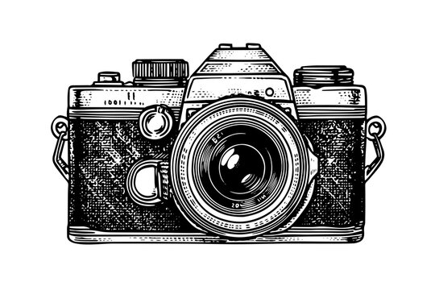

<p align="left">
  
  <h1>Photobooth</h1>
</p>

<br clear="left"/>

## What is the Project
Vintage Photobooth is a modern, interactive web application that brings the fun and nostalgia of a physical photobooth straight to your browser. Users can take a series of timed photos using their webcam, choose customized layouts, apply creative image filters, and download their vintage-style photostrips instantly.

## Tech Stack
- **Frontend Framework**: React 18
- **Language**: TypeScript
- **Build Tool**: Vite
- **Styling**: Tailwind CSS v4
- **Routing**: React Router DOM
- **Icons**: Lucide React
- **Image Processing**: HTML5 Canvas API

## Project Structure
```text
Photobooth/
├── public/
│   └── camera.jpg         # Favicon and README image
├── src/
│   ├── assets/
│   │   ├── camera.jpg
│   │   └── ...
│   ├── components/
│   │   └── PhotoStrip.tsx # Canvas rendering logic
│   ├── pages/
│   │   ├── Home.tsx       # Landing page
│   │   ├── CameraCapture.tsx # Webcam & sequence logic
│   │   └── Customize.tsx  # Layout, colors, & filters
│   ├── App.tsx            # Main router configuration
│   ├── main.tsx           # React mounting point
│   ├── index.css          # Tailwind CSS and fonts
│   └── vite-env.d.ts      # Vite type declarations
├── package.json
├── postcss.config.js
├── tsconfig.json
└── vite.config.ts
```

## How to Run

1. **Install Dependencies**
   Navigate to the project root and install the necessary packages using npm:
   ```bash
   npm install
   ```

2. **Start the Development Server**
   Launch the app locally:
   ```bash
   npm run dev
   ```

3. **Open in Browser**
   Once the server starts, open your browser and navigate to the local URL provided in your terminal (usually `http://localhost:5173`).

4. **Build for Production** (Optional)
   If you want to build the project for deployment:
   ```bash
   npm run build
   ```
